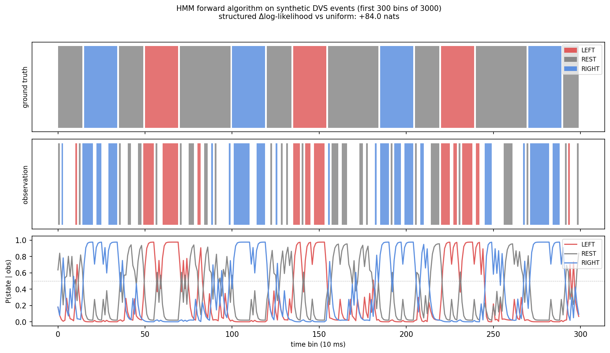

# HMM Forward Algorithm on Synthetic DVS Events

A small demo that recovers hidden motion states from noisy event-camera data using the HMM forward algorithm — no real event-camera hardware required.

The idea: a 5-pixel-wide vertical bar drifts across a 64×64 sensor, switching between LEFT, REST, and RIGHT motion modes. Each mode fires a characteristic pattern of ON/OFF events. The forward algorithm reads those events bin-by-bin and maintains a running belief over which mode is active.



## How it works

**Event simulation** — the bar moves at ±2 px per 10 ms bin. When it crosses a column boundary it emits ON events on the leading edge and OFF events on the trailing edge, mimicking how a real DVS sensor responds to contrast changes. Random noise events (~5% of pixels per bin) are sprinkled on top.

**Observation extraction** — within each bin, net horizontal flow is estimated as `mean_x(ON) − mean_x(OFF)`. A rightward-moving bar pushes ON events ahead of OFF events, giving a positive flow signal. The result is discretized into three symbols: LEFT_FLOW, NO_FLOW, RIGHT_FLOW.

**Inference** — a three-state HMM (LEFT / REST / RIGHT) with hand-set transition and emission matrices runs the forward algorithm in log space. The filtered posterior `P(state | observations so far)` tracks mode switches with a small lag of a few bins.

**Sanity check** — the same observations are also fed to a baseline HMM with uniform transitions. The structured model wins by a wide margin in log-likelihood, confirming the transition structure is doing real work.

The posterior closely follows the ground truth, lagging by a few bins at transitions. That lag is expected: the forward algorithm is causal and needs a handful of observations to shift its belief after a mode change.

## Parameters

The HMM matrices are hand-set rather than learned. The transition matrix encodes a strong self-transition prior (0.90) with small probability of switching modes. The emission matrix reflects that LEFT motion mostly produces LEFT_FLOW but occasionally produces noise observations, and so on.

```
A (transitions)            
LEFT  → [0.90 0.08 0.02]   
REST  → [0.05 0.90 0.05]   
RIGHT → [0.02 0.08 0.90]   

B (emissions: L / N / R flow)
LEFT  → [0.75 0.20 0.05]
REST  → [0.15 0.70 0.15]
RIGHT → [0.05 0.20 0.75]
```

